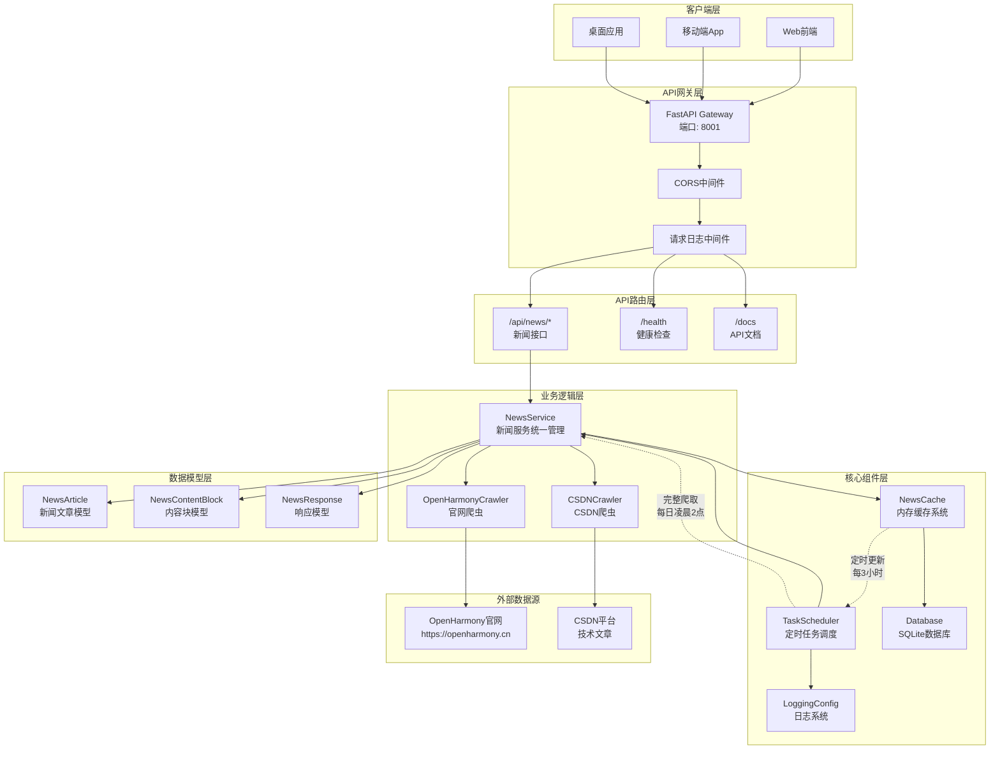
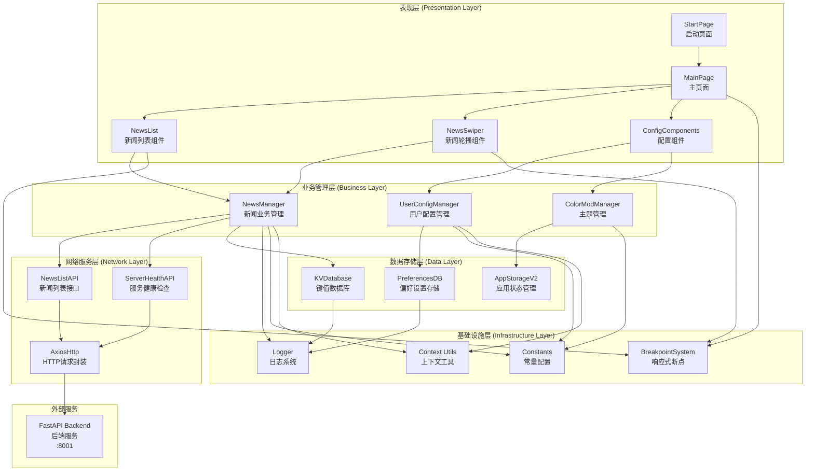
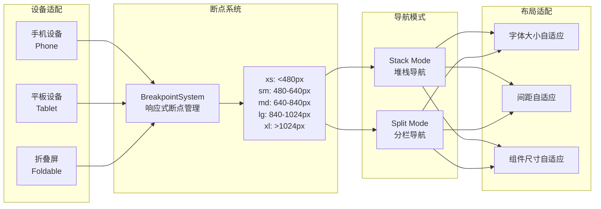
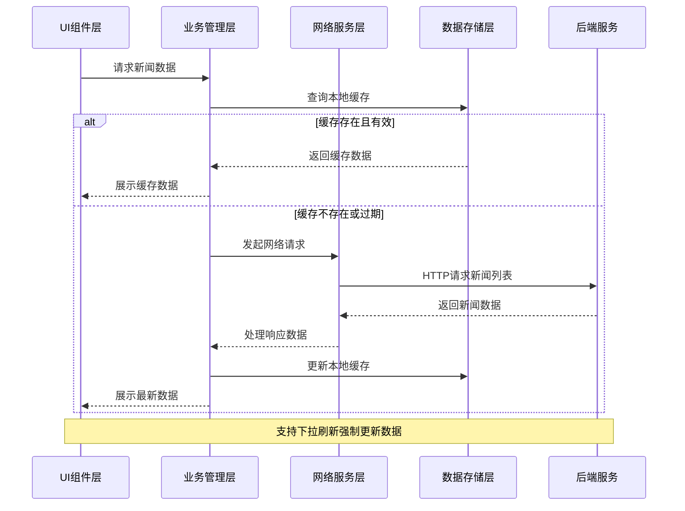

# NowInOpenHarmony 项目架构文档

## 项目简介
NowInOpenHarmony项目，是基于当下OpenHarmony相关资讯分散在各个平台，并无一个汇总相关新闻资讯平台的现状而开发的新闻汇总软件。

## 项目架构
项目包含服务端以及客户端，采用前后端分离模式开发。

### 服务端架构
服务端采用FastAPI框架构建，采用模块化分层架构设计。

#### 1. 技术栈
- **框架**: FastAPI 0.104.1 - 高性能异步Web框架
- **运行时**: Python 3.9+ with Uvicorn ASGI服务器
- **数据库**: SQLite (支持扩展至PostgreSQL)
- **网络爬虫**: BeautifulSoup4 + Selenium + Requests
- **任务调度**: APScheduler - 定时任务管理
- **数据模型**: Pydantic - 数据验证与序列化
- **容器化**: Docker + Docker Compose

#### 2. 项目结构
```
Server/
├── main.py                 # FastAPI应用入口
├── run.py                  # 应用启动脚本
├── requirements.txt        # Python依赖包
├── Dockerfile             # Docker镜像构建配置
├── docker-compose.yml     # 容器编排配置
├── api/                   # API路由层
│   └── news.py           # 新闻相关接口
├── core/                  # 核心组件层
│   ├── config.py         # 应用配置管理
│   ├── database.py       # 数据库连接与操作
│   ├── cache.py          # 内存缓存管理
│   ├── scheduler.py      # 定时任务调度
│   └── logging_config.py # 日志配置
├── models/                # 数据模型层
│   └── news.py           # 新闻数据模型
├── services/              # 业务逻辑层
│   ├── news_service.py           # 新闻服务统一管理
│   ├── openharmony_crawler.py   # OpenHarmony官网爬虫
│   └── csdn_openharmony_crawler.py # CSDN爬虫
├── types/                 # TypeScript类型定义
│   └── news.ts           # 前端数据类型
└── logs/                  # 应用日志目录
```

#### 3. 核心架构设计

##### 3.1 系统架构图



##### 3.2 分层架构
- **API层 (api/)**: RESTful API接口定义，处理HTTP请求响应
- **业务逻辑层 (services/)**: 核心业务逻辑，数据处理和爬虫管理
- **数据模型层 (models/)**: Pydantic数据模型，数据验证和序列化
- **核心组件层 (core/)**: 基础设施组件，配置、数据库、缓存、调度

##### 3.3 数据流架构
```
[定时调度] → [爬虫服务] → [数据验证] → [缓存更新] → [API响应]
    ↓            ↓           ↓           ↓          ↓
[TaskScheduler] [NewsService] [Pydantic] [NewsCache] [FastAPI]
```

### 客户端架构

客户端基于API18构建，采用ArkTS语言开发，遵循现代化模块化设计原则。

#### 1. 技术栈
- **开发语言**: ArkTS
- **网络请求**: @ohos/axios 2.2.6 - HTTP客户端库
- **Markdown渲染**: @lidary/markdown 2.0.4 - 代码内容渲染
- **数据存储**: 
  - KV数据库 (Key-Value存储)
  - Preferences (轻量级偏好设置)
- **设备支持**: 手机、平板、折叠屏设备

#### 2. 项目结构
```
根目录/
├── AppScope/                       # 应用级配置
│   ├── app.json5                  # 应用配置文件
│   └── resources/                 # 应用级资源文件
│       ├── base/element/          # 多语言字符串资源
│       └── base/media/            # 应用图标与启动图
├── build-profile.json5            # 构建配置文件
├── oh-package.json5               # 依赖包管理配置
├── product/default/               # 主应用模块 (Entry Module)
│   └── src/main/
│       ├── ets/                   # ArkTS源码目录
│       │   ├── entryability/      # 应用生命周期管理
│       │   ├── pages/             # 页面文件
│       │   │   ├── StartPage.ets  # 启动页
│       │   │   └── Index.ets      # 主页面
│       │   └── init/              # 应用初始化
│       ├── module.json5           # 模块配置
│       └── resources/             # 模块资源文件
├── commons/common/                # 公共基础库 (HSP共享包)
│   └── src/main/ets/
│       ├── api/                   # 网络接口层
│       │   ├── http/              # HTTP请求封装
│       │   ├── news/              # 新闻API接口
│       │   └── serverHealth/      # 服务健康检查
│       ├── db/                    # 数据库操作层
│       │   ├── keyValueDB/        # KV数据库封装
│       │   └── preferencesDB/     # 偏好设置数据库
│       ├── modules/               # 核心模块定义
│       │   ├── news/              # 新闻数据模型
│       │   ├── constants.ets      # 应用常量定义
│       │   ├── config/            # 配置管理
│       │   ├── context/           # 上下文工具
│       │   ├── breakPoint/        # 响应式断点系统
│       │   └── view/              # 视图工具类
│       └── utils/                 # 工具函数库
│           ├── logger/            # 日志系统
│           └── breakPoint/        # 断点工具
└── features/feature/              # 功能特性模块 (HSP共享包)
    └── src/main/ets/
        ├── components/            # UI组件库
        │   ├── mainPageComponents/# 主页面组件
        │   │   ├── NewsList.ets   # 新闻列表组件
        │   │   └── NewsSwiper.ets # 新闻轮播组件
        │   └── ConfigeComponents/ # 配置页面组件
        ├── managers/              # 业务管理器
        │   ├── NewsManager.ets    # 新闻数据管理
        │   ├── UserConfigManager.ets # 用户配置管理
        │   └── ColorModManager.ets   # 主题模式管理
        ├── pages/                 # 功能页面
        │   └── Index.ets          # 功能首页
        └── utils/                 # 功能工具类
```

#### 3. 架构设计

##### 3.1 应用架构图



##### 3.2 模块化架构设计

应用采用模块化架构，分为三个主要模块：

1. **Entry Module (product/default)**
   - 应用入口模块，负责应用生命周期管理
   - 包含启动页面和主页面导航
   - 处理应用初始化和路由管理

2. **Common HSP (commons/common)**
   - 公共基础库，提供核心功能和工具类
   - 包含网络请求、数据库操作、工具函数

3. **Feature HSP (features/feature)**
   - 功能特性模块，包含业务组件和管理器
   - 实现新闻展示、用户配置等核心功能
   - 封装可复用的UI组件和业务逻辑

##### 3.3 响应式设计架构

应用支持多设备适配，采用响应式设计：



##### 3.4 数据流架构



##### 3.5 状态管理架构

应用采用多层状态管理机制：

1. **应用级状态 (AppStorageV2)**
   - 导航路径栈管理
   - 全局主题配置
   - 响应式断点状态

2. **页面级状态 (@Local)**
   - 页面数据状态
   - UI交互状态
   - 组件可见性状态

3. **持久化存储**
   - KV数据库：存储新闻数据
   - Preferences：存储用户配置
   - 支持数据同步和备份

##### 3.6 性能优化设计

1. **懒加载 (LazyForEach)**
   - 新闻列表采用虚拟滚动
   - 按需渲染列表项
   - 优化大数据量场景性能

2. **数据缓存策略**
   - 内存缓存：热点数据快速访问
   - 本地缓存：离线数据支持
   - 智能更新：增量数据同步

3. **UI动画优化**
   - 页面转场动画
   - 组件状态动画
   - 流畅的用户体验

#### 4. 关键组件说明

##### 4.1 NewsManager (新闻管理器)
- **功能**: 统一管理新闻数据的获取、缓存和更新
- **特性**:
  - 自动服务健康检查
  - 智能数据缓存策略
  - 异常处理和重试机制
  - 支持离线数据访问

##### 4.2 BreakpointSystem (响应式断点系统)
- **功能**: 提供跨设备的响应式布局支持
- **特性**:
  - 自动设备类型检测
  - 动态断点监听
  - 布局模式自适应切换
  - 组件样式动态调整

##### 4.3 NewsList (新闻列表组件)
- **功能**: 高性能新闻列表展示组件
- **特性**:
  - 虚拟滚动优化
  - 粘性头部设计
  - 平滑动画效果
  - 多设备适配支持

##### 4.4 网络请求架构
- **AxiosHttp**: 封装的HTTP请求客户端
- **拦截器机制**: 统一请求/响应处理
- **错误处理**: 完善的异常捕获和用户提示
- **超时控制**: 3秒请求超时设置

#### 5. 开发规范

##### 5.1 代码结构规范
- 采用ArkTS语言开发，遵循TypeScript规范
- 使用@ComponentV2装饰器开发现代化组件
- 统一的命名规范和代码风格
- 完善的注释和文档说明

##### 5.2 模块划分规范
- **Entry Module**: 应用入口和生命周期管理
- **Common HSP**: 公共基础功能和工具
- **Feature HSP**: 业务功能和UI组件
- 清晰的模块依赖关系和接口定义

##### 5.3 资源管理规范
- 多语言支持 (中文/英文)
- 深色/浅色主题适配
- 统一的颜色和字体规范
- 矢量图标和高分辨率图片支持

## 功能特性

### 核心功能
- ✅ OpenHarmony新闻聚合展示
- ✅ 多数据源新闻抓取 (官网、CSDN等)
- ✅ 响应式多设备适配
- ✅ 深色/浅色主题切换
- ✅ 离线数据缓存支持
- ✅ 下拉刷新数据更新
- ✅ 流畅的动画效果

### 技术亮点
- 🎯 现代化模块化架构设计
- 🚀 高性能虚拟滚动列表
- 📱 完善的多设备适配方案
- 🎨 优雅的UI设计和动画效果
- 🛡️ 完善的错误处理机制
- 💾 智能数据缓存策略

