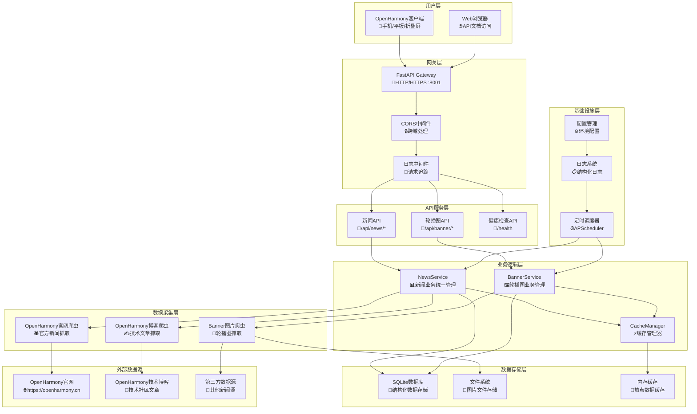
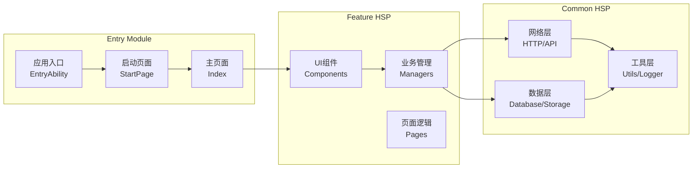
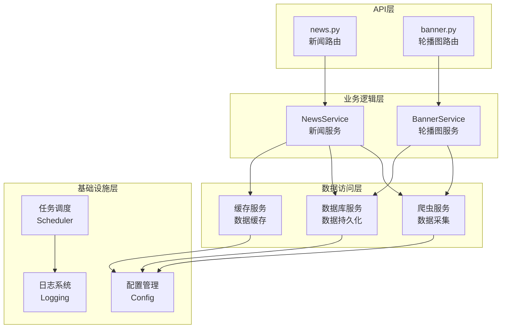
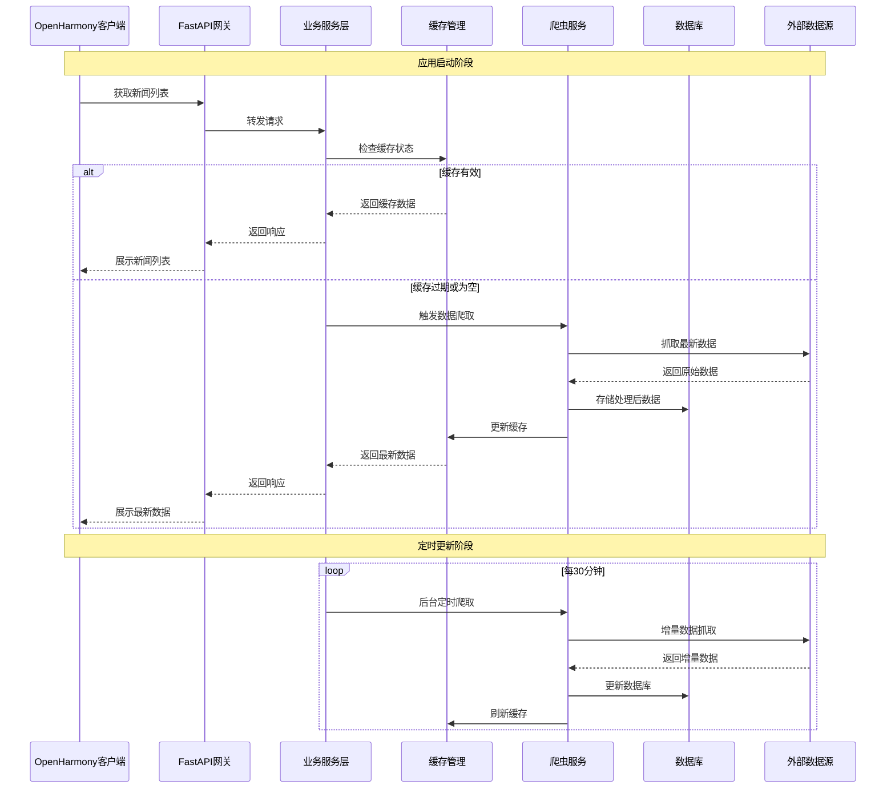

# NowInOpenHarmony

<div align="center">

**一个专为OpenHarmony生态打造的新闻资讯聚合应用**

[](https://opensource.org/licenses/Apache-2.0)
[](https://gitee.com/openharmony)
[](https://www.python.org/)
[](https://fastapi.tiangolo.com/)

[运行演示](#运行演示) • [功能特性](#功能特性) • [快速开始](#快速开始) • [项目架构](#项目架构) • [API文档](#api文档) • [开发指南](#开发指南) • [贡献指南](#贡献指南)

</div>

## 📖 项目简介

NowInOpenHarmony是一个专为OpenHarmony生态开发的新闻资讯聚合应用。项目采用前后端分离架构，聚合OpenHarmony官方网站、技术博客等多源新闻数据，为OpenHarmony开发者和用户提供一站式的资讯服务。

### 🎯 项目背景

目前OpenHarmony开源项目已成规模，生态日益繁荣，但与OpenHarmony相关的资讯平台多为网站且比较零散，另外OpenHarmony应用比较缺乏，应用生态是未来发展重点。结合上述两个现状，本项目目标为：

- **资讯聚合**：将分散的OpenHarmony资讯整合到一个平台
- **原生应用**：开发运行在OpenHarmony系统上的原生应用
- **生态建设**：为OpenHarmony应用生态贡献力量
- **开发体验**：提供优质的用户体验和开发体验

### ✨ 核心价值

- 🎯 **精准聚合**：智能抓取OpenHarmony官方和社区优质内容
- 📱 **原生体验**：基于OpenHarmony API开发的原生应用
- 🚀 **高性能**：采用现代化技术栈，提供流畅的用户体验
- 🔄 **实时更新**：自动定时更新，确保信息时效性
- 🌙 **响应式设计**：支持多设备、多主题的响应式适配

## 📺 运行演示


## 🚀 功能特性

### 📊 数据聚合
- **多源抓取**：自动抓取OpenHarmony官网、技术博客等多个数据源
- **智能去重**：基于内容哈希的智能去重算法，避免重复信息
- **数据清洗**：自动处理和标准化新闻数据格式
- **增量更新**：支持增量数据同步，优化网络资源使用

### 📱 客户端功能
- **新闻浏览**：清晰的新闻列表和详情页面
- **分类筛选**：按照新闻类型和来源进行筛选
- **搜索功能**：支持关键词搜索新闻内容
- **离线阅读**：本地缓存机制，支持离线浏览
- **主题切换**：深色/浅色主题无缝切换
- **响应式布局**：适配手机、平板、折叠屏等多种设备

### 🔧 后端服务
- **RESTful API**：提供标准化的数据接口
- **定时任务**：自动定时抓取和更新数据
- **缓存机制**：多层缓存策略，提升响应速度
- **健康监控**：完善的服务状态监控和告警
- **容器部署**：支持Docker容器化部署
- **并发处理**：多线程爬虫，支持高并发数据处理

### 🛡️ 技术亮点
- **高性能**：虚拟滚动、懒加载等性能优化技术
- **稳定可靠**：完善的错误处理和重试机制
- **扩展性强**：模块化设计，易于扩展新的数据源
- **开发友好**：完整的开发文档和API文档

## 🛠️ 技术栈

### 前端技术栈
| 技术 | 版本 | 描述 |
|------|------|------|
| **OpenHarmony** | API 18+ | 目标运行平台 |
| **ArkTS** | Latest | 主要开发语言 |
| **ArkUI** | Latest | UI框架，声明式开发 |
| **@ohos/axios** | ^2.2.6 | HTTP网络请求库 |
| **@lidary/markdown** | ^2.0.4 | Markdown内容渲染 |
| **HSP模块** | - | 共享包模块化架构 |

### 后端技术栈
| 技术 | 版本 | 描述 |
|------|------|------|
| **Python** | 3.8+ | 主要开发语言 |
| **FastAPI** | 0.104+ | 高性能Web框架 |
| **SQLite** | Latest | 轻量级数据库（可扩展PostgreSQL） |
| **SQLAlchemy** | Latest | ORM框架 |
| **BeautifulSoup4** | Latest | HTML解析库 |
| **Selenium** | Latest | 动态网页抓取 |
| **APScheduler** | Latest | 定时任务调度 |
| **Pydantic** | Latest | 数据验证和序列化 |
| **Uvicorn** | Latest | ASGI服务器 |

### 开发工具
| 工具 | 描述 |
|------|------|
| **DevEco Studio** | OpenHarmony官方IDE |
| **Docker** | 容器化部署 |
| **Git** | 版本控制 |
| **Postman** | API测试工具 |

## 📦 项目结构

```
NowInOpenHarmony/
├── 📁 APP/                          # OpenHarmony客户端应用
│   └── NowInOpenHarmony/
│       ├── 📁 AppScope/             # 应用级配置
│       ├── 📁 commons/common/       # 公共基础库(HSP)
│       │   └── src/main/ets/
│       │       ├── 📁 api/          # 网络接口层
│       │       ├── 📁 db/           # 数据库操作层  
│       │       ├── 📁 modules/      # 核心模块定义
│       │       └── 📁 utils/        # 工具函数库
│       ├── 📁 features/feature/     # 功能特性模块(HSP)
│       │   └── src/main/ets/
│       │       ├── 📁 components/   # UI组件库
│       │       ├── 📁 managers/     # 业务管理器
│       │       └── 📁 pages/        # 功能页面
│       └── 📁 product/default/      # 主应用模块(Entry)
│           └── src/main/ets/
│               ├── 📁 entryability/ # 应用生命周期
│               ├── 📁 pages/        # 应用页面
│               └── 📁 init/         # 应用初始化
└── 📁 Server/                       # Python后端服务
    ├── 📁 api/                      # API路由层
    │   ├── news.py                  # 新闻接口
    │   └── banner.py                # 轮播图接口
    ├── 📁 core/                     # 核心组件层
    │   ├── cache.py                 # 缓存管理
    │   ├── config.py                # 配置管理
    │   ├── database.py              # 数据库管理
    │   ├── logging_config.py        # 日志配置
    │   └── scheduler.py             # 定时任务
    ├── 📁 models/                   # 数据模型层
    │   ├── news.py                  # 新闻模型
    │   └── banner.py                # 轮播图模型
    ├── 📁 services/                 # 业务逻辑层
    │   ├── news_service.py          # 新闻服务
    │   ├── openharmony_crawler.py   # 官网爬虫
    │   └── openharmony_blog_crawler.py # 博客爬虫
    ├── main.py                      # FastAPI应用入口
    ├── requirements.txt             # Python依赖
    └── docker-compose.yml           # 容器编排
```

## 🚀 快速开始

### 📋 环境要求

#### 后端环境
- **Python**: 3.8 或更高版本
- **pip**: Python包管理器
- **Git**: 版本控制工具（可选）

#### 前端环境
- **DevEco Studio**: 5.0 或更高版本
- **OpenHarmony SDK**: API 18 或更高版本
- **Node.js**: 16.0 或更高版本（用于包管理）

### 🛠️ 安装部署

#### 1. 后端服务部署

**克隆项目**
```bash
git clone <repository-url>
cd NowInOpenHarmony/Server
```

**安装依赖**
```bash
pip install -r requirements.txt
```

**启动服务**
```bash
# 方式1：使用启动脚本（推荐）
python run.py

# 方式2：直接使用uvicorn
uvicorn main:app --host 0.0.0.0 --port 8001 --reload
```

**Docker部署（推荐）**
```bash
# 使用Docker Compose一键部署
docker-compose up -d

# 查看服务状态
docker-compose ps

# 查看日志
docker-compose logs -f
```

**验证服务**
- 服务地址: http://localhost:8001
- API文档: http://localhost:8001/docs
- 健康检查: http://localhost:8001/health

#### 2. 客户端应用构建

**打开项目**
1. 启动DevEco Studio
2. 选择"Open Project"
3. 导航到`APP/NowInOpenHarmony`目录并打开

**配置SDK**
1. 在DevEco Studio中配置OpenHarmony SDK
2. 确保SDK版本为API 18或更高

**构建应用**
```bash
# 在项目根目录执行
hvigor assembleHap --mode module -p product=default
```

**安装到设备**
1. 连接OpenHarmony设备或启动模拟器
2. 在DevEco Studio中点击"Run"按钮
3. 选择目标设备进行安装

### ⚙️ 配置说明

#### 后端配置

**环境变量配置**
```bash
# 创建.env文件
cp .env.example .env

# 编辑配置
vim .env
```

**主要配置项**
```env
# 应用配置
APP_NAME=NowInOpenHarmony API
APP_VERSION=1.0.0
DEBUG=false

# 服务配置
HOST=0.0.0.0
PORT=8001
RELOAD=false

# 数据库配置
DATABASE_URL=sqlite:///./openharmony_news.db

# 爬虫配置
CRAWLER_DELAY=1.0
CRAWLER_TIMEOUT=10
MAX_RETRIES=3

# 定时任务配置
ENABLE_SCHEDULER=true
CACHE_UPDATE_INTERVAL=30
FULL_CRAWL_HOUR=2
```

#### 客户端配置

**网络配置**
```typescript
// commons/common/src/main/ets/modules/config/NetworkConfig.ets
export const NetworkConfig = {
  baseUrl: 'http://localhost:8001',  // 修改为实际后端地址
  timeout: 30000,
  retryCount: 3
}
```

**应用配置**
```json5
// AppScope/app.json5
{
  "app": {
    "bundleName": "com.xbxyftx.nowinharmony",
    "vendor": "XBXyftx",
    "versionCode": 1000000,
    "versionName": "1.0.0"
  }
}
```

## 🏗️ 项目架构

### 📊 整体架构图



### 🎯 分层架构详解

#### 1. 客户端架构 (OpenHarmony App)

**模块化设计**


**响应式设计**
- **断点系统**: 自动适配不同屏幕尺寸
- **布局模式**: Stack/Split导航模式切换
- **主题系统**: 深色/浅色主题动态切换
- **组件适配**: 字体、间距、尺寸自适应调整

#### 2. 后端架构 (FastAPI Service)

**分层架构**


**核心特性**
- **多线程爬虫**: ThreadPoolExecutor管理并发任务
- **智能缓存**: 多层缓存策略，状态精确管理
- **定时调度**: 自动数据更新，支持增量同步
- **错误处理**: 完善的异常捕获和重试机制

### 🔄 数据流程图



### 🛡️ 安全与性能

#### 安全机制
- **CORS配置**: 跨域请求安全控制
- **输入验证**: Pydantic数据模型验证
- **错误隐藏**: 生产环境敏感信息保护
- **访问控制**: API访问频率限制

#### 性能优化
- **虚拟滚动**: 大数据量列表性能优化
- **懒加载**: 按需加载组件和数据
- **数据缓存**: 多层缓存减少网络请求
- **并发处理**: 多线程爬虫提升数据采集效率

## 📋 API文档

### 🔗 API基础信息

- **Base URL**: `http://localhost:8001`
- **API Version**: `v1.0.0`
- **Content-Type**: `application/json`
- **在线文档**: `http://localhost:8001/docs` (Swagger UI)
- **备用文档**: `http://localhost:8001/redoc` (ReDoc)

### 📰 新闻接口

#### 获取新闻列表
```http
GET /api/news/
```

**查询参数**
| 参数 | 类型 | 必填 | 描述 | 默认值 |
|------|------|------|------|--------|
| page | int | 否 | 页码 | 1 |
| size | int | 否 | 每页数量 | 20 |
| category | string | 否 | 新闻分类 | all |
| search | string | 否 | 搜索关键词 | - |
| source | string | 否 | 数据源 | all |

**响应示例**
```json
{
  "code": 200,
  "message": "success",
  "data": {
    "total": 150,
    "page": 1,
    "size": 20,
    "items": [
      {
        "id": "article_123",
        "title": "OpenHarmony 5.0版本正式发布",
        "summary": "OpenHarmony 5.0带来了更多新特性...",
        "content": "详细内容...",
        "source": "openharmony_official",
        "category": "release",
        "publish_time": "2025-01-15T10:30:00Z",
        "url": "https://openharmony.cn/news/123",
        "image_url": "https://example.com/image.jpg"
      }
    ]
  }
}
```

#### 获取新闻详情
```http
GET /api/news/{article_id}
```

**路径参数**
| 参数 | 类型 | 必填 | 描述 |
|------|------|------|------|
| article_id | string | 是 | 文章ID |

#### 手动触发爬取
```http
POST /api/news/crawl
```

**请求体**
```json
{
  "source": "openharmony_official",  // 可选：指定数据源
  "force": true                     // 可选：强制刷新
}
```

#### 获取服务状态
```http
GET /api/news/status/info
```

**响应示例**
```json
{
  "status": "healthy",
  "cache_count": 150,
  "last_update": "2025-01-15T10:30:00Z",
  "sources": {
    "openharmony_official": {
      "status": "active",
      "last_crawl": "2025-01-15T10:30:00Z",
      "total_articles": 80
    },
    "openharmony_blog": {
      "status": "active", 
      "last_crawl": "2025-01-15T10:25:00Z",
      "total_articles": 70
    }
  }
}
```

### 🎠 轮播图接口

#### 获取轮播图列表
```http
GET /api/banner/mobile
```

**响应示例**
```json
{
  "code": 200,
  "message": "success",
  "data": {
    "banners": [
      {
        "id": "banner_001",
        "title": "OpenHarmony 技术峰会",
        "image_url": "https://example.com/banner1.jpg",
        "link_url": "https://openharmony.cn/summit",
        "sort_order": 1
      }
    ],
    "total": 5,
    "last_update": "2025-01-15T10:30:00Z"
  }
}
```

#### 手动触发轮播图爬取
```http
POST /api/banner/crawl
```

### 💓 健康检查接口

#### 基础健康检查
```http
GET /health
```

#### 详细服务状态
```http
GET /api/health
```

### 🔧 状态码说明

| 状态码 | 说明 |
|--------|------|
| 200 | 请求成功 |
| 400 | 请求参数错误 |
| 404 | 资源不存在 |
| 500 | 服务器内部错误 |
| 503 | 服务不可用（缓存更新中） |

## 🔧 开发指南

### 📋 开发文档
项目包含完整的开发指南文档：
- **`CLAUDE.md`**: Claude Code开发指南，包含构建命令、架构说明、开发工作流程
- **`README.md`**: 项目主文档，功能特性和使用指南
- **`Server/README.md`**: 后端服务详细说明和API文档
- **`APP/NowInOpenHarmony/README.md`**: 客户端架构文档

### 🛠️ 开发环境搭建

#### 后端开发环境
1. **安装Python 3.8+**
2. **创建虚拟环境**
   ```bash
   python -m venv venv
   source venv/bin/activate  # Linux/Mac
   venv\Scripts\activate     # Windows
   ```
3. **安装开发依赖**
   ```bash
   pip install -r requirements.txt
   pip install -r requirements-dev.txt  # 开发依赖
   ```
4. **配置开发环境**
   ```bash
   cp .env.example .env
   vim .env  # 编辑配置
   ```

#### 前端开发环境
1. **安装DevEco Studio 5.0+**
2. **配置OpenHarmony SDK**
3. **安装hvigor构建工具**
   ```bash
   npm install -g @ohos/hvigor
   ```

### 📝 代码规范

#### Python代码规范
- **PEP 8**: 遵循Python官方代码规范
- **Type Hints**: 使用类型注解提高代码可读性
- **Docstring**: 使用Google风格的文档字符串
- **Import排序**: 使用isort工具自动排序导入

**示例代码**
```python
from typing import List, Optional
from pydantic import BaseModel

class NewsArticle(BaseModel):
    """新闻文章模型
    
    Attributes:
        id: 文章唯一标识
        title: 文章标题
        content: 文章内容
    """
    id: str
    title: str
    content: Optional[str] = None
    
    def get_summary(self, max_length: int = 100) -> str:
        """获取文章摘要
        
        Args:
            max_length: 摘要最大长度
            
        Returns:
            文章摘要字符串
        """
        if not self.content:
            return ""
        return self.content[:max_length] + "..." if len(self.content) > max_length else self.content
```

#### ArkTS代码规范
- **命名规范**: 使用驼峰命名法
- **组件结构**: 遵循@ComponentV2装饰器规范
- **状态管理**: 合理使用@Local、@State等装饰器
- **模块化**: 按功能模块组织代码结构

**示例代码**
```typescript
@ComponentV2
export struct NewsListComponent {
  @Local newsData: NewsArticle[] = []
  @Local isLoading: boolean = false
  
  async loadNews(): Promise<void> {
    this.isLoading = true
    try {
      const response = await NewsAPI.getNewsList()
      this.newsData = response.data.items
    } catch (error) {
      Logger.error('加载新闻失败', error)
    } finally {
      this.isLoading = false
    }
  }
  
  build() {
    Column() {
      if (this.isLoading) {
        LoadingAnimation()
      } else {
        LazyForEach(this.newsData, (item: NewsArticle) => {
          NewsItemComponent({ article: item })
        })
      }
    }
  }
}
```

### 🔍 测试指南

#### 后端测试
```bash
# 运行单元测试
pytest tests/

# 运行覆盖率测试
pytest --cov=src tests/

# 运行特定测试
pytest tests/test_news_service.py
```

#### 前端测试
```bash
# 运行单元测试
npm test

# 运行UI测试
hvigor test
```

### 📦 构建部署

#### 后端构建
```bash
# 生产环境构建
docker build -t nowinharmony-api .

# 部署到生产环境
docker-compose -f docker-compose.prod.yml up -d
```

#### 前端构建
```bash
# 构建HAP包
hvigor assembleHap --mode module -p product=default

# 构建签名版本
hvigor assembleHap --mode module -p product=default -p signMode=release
```

### 🔧 常见问题

#### 后端常见问题
1. **数据库连接失败**
   - 检查DATABASE_URL配置
   - 确认数据库文件权限

2. **爬虫抓取失败**
   - 检查网络连接
   - 验证目标网站可访问性
   - 查看日志文件排查错误

3. **缓存状态异常**
   - 重启服务重新初始化缓存
   - 检查内存使用情况

#### 前端常见问题
1. **网络请求失败**
   - 检查后端服务是否启动
   - 验证网络配置是否正确

2. **页面渲染异常**
   - 检查数据模型是否匹配
   - 查看DevEco Studio控制台错误信息

3. **设备适配问题**
   - 检查断点系统配置
   - 验证响应式布局代码

## 🤝 贡献指南

### 🌟 如何贡献

我们欢迎各种形式的贡献！无论是报告Bug、提出功能建议，还是提交代码改进，都是对项目的宝贵贡献。

#### 贡献类型
- 🐛 **Bug报告**: 发现并报告应用中的问题
- 💡 **功能建议**: 提出新功能或改进建议
- 📝 **文档改进**: 完善项目文档和说明
- 🔧 **代码贡献**: 修复Bug或实现新功能
- 🎨 **UI/UX改进**: 优化用户界面和体验
- 🌍 **本地化**: 添加多语言支持

### 📋 贡献流程

1. **Fork项目**
   ```bash
   # 在GitHub/Gitee上Fork项目到个人仓库
   git clone https://github.com/yourusername/NowInOpenHarmony.git
   cd NowInOpenHarmony
   ```

2. **创建分支**
   ```bash
   # 从main分支创建功能分支
   git checkout -b feature/your-feature-name
   
   # 或从main分支创建修复分支
   git checkout -b fix/your-bug-fix
   ```

3. **开发和测试**
   ```bash
   # 进行开发
   # ... 编写代码 ...
   
   # 运行测试
   pytest  # 后端测试
   npm test  # 前端测试
   
   # 代码格式化
   black .  # Python代码格式化
   ```

4. **提交更改**
   ```bash
   git add .
   git commit -m "feat: 添加新闻搜索功能
   
   - 实现关键词搜索API
   - 添加搜索结果高亮
   - 优化搜索性能
   
   Closes #123"
   ```

5. **推送和创建PR**
   ```bash
   git push origin feature/your-feature-name
   # 在GitHub/Gitee上创建Pull Request
   ```

### 📝 提交规范

我们使用[Conventional Commits](https://conventionalcommits.org/)规范：

```
<type>[optional scope]: <description>

[optional body]

[optional footer(s)]
```

**类型说明**
- `feat`: 新功能
- `fix`: Bug修复
- `docs`: 文档更新
- `style`: 代码格式（不影响功能）
- `refactor`: 代码重构
- `perf`: 性能优化
- `test`: 测试相关
- `chore`: 构建工具或辅助工具的变动

**示例**
```bash
feat(api): 添加新闻分类筛选功能

- 实现按类别筛选新闻的API接口
- 添加分类字段到新闻模型
- 更新API文档

Closes #45
```

### 🔍 代码审查

所有贡献都需要通过代码审查：

1. **自动检查**
   - 代码格式检查
   - 单元测试通过
   - 构建成功

2. **人工审查**
   - 代码质量评估
   - 功能正确性验证
   - 文档完整性检查

3. **审查标准**
   - 遵循项目代码规范
   - 包含必要的测试用例
   - 更新相关文档
   - 保持向后兼容性

### 🏷️ Issue标签

我们使用以下标签来组织Issues：

| 标签 | 描述 |
|------|------|
| `bug` | 确认的Bug |
| `enhancement` | 功能增强 |
| `documentation` | 文档相关 |
| `good-first-issue` | 适合新手 |
| `help-wanted` | 需要帮助 |
| `priority-high` | 高优先级 |
| `backend` | 后端相关 |
| `frontend` | 前端相关 |

### 📞 联系方式

- **项目维护者**: XBXyftx
- **邮箱**: shuaixbx02@outlook.com

### 📄 许可证

本项目采用Apache 2.0许可证，详情请查看[LICENSE](LICENSE)文件。

通过贡献代码，您同意将您的贡献按照Apache 2.0许可证进行许可。

---

## 📚 相关资源

### 官方文档
- [OpenHarmony官方文档](https://docs.openharmony.cn/)
- [DevEco Studio用户指南](https://developer.huawei.com/consumer/cn/doc/deveco-studio)
- [ArkTS开发指南](https://docs.openharmony.cn/pages/v4.1/zh-cn/application-dev/arkts-utils/arkts-overview.md)
- [FastAPI官方文档](https://fastapi.tiangolo.com/)

### 学习资源
- [OpenHarmony开发样例](https://gitee.com/openharmony/applications_sample_camera)
- [ArkUI组件参考](https://docs.openharmony.cn/pages/v4.1/zh-cn/application-dev/reference/apis-arkui/arkui-ts/ts-components-summary.md)
- [Python FastAPI教程](https://fastapi.tiangolo.com/tutorial/)

### 社区支持
- [OpenHarmony开发者社区](https://openharmony.cn/community)
- [OpenHarmony技术论坛](https://forums.openharmony.cn/)
- [OpenHarmony GitHub](https://github.com/eclipse-oniro-mirrors)

---

<div align="center">

**⭐ 如果这个项目对您有帮助，请给它一个星标！⭐**

**感谢所有为OpenHarmony生态做出贡献的开发者们！**

Made with ❤️ by [XBXyftx](https://github.com/XBXyftx)

</div>

---

## 📝 更新日志

### 🆕 最新版本更新 (v1.2.0)

#### ✨ 新增功能
- **字体大小调节功能** *(已完成)*
  - 在原深浅色切换按钮下方新增字体大小调节按钮
  - 可以调节文章详情页全部字体大小，支持12-24px范围调节
  - 该功能UI完整支持深浅色模式
  - 平板与手机具有差异化UI体验：
    - 手机端：拉起半模态转场来进行字体大小选择
    - 平板端：拉起自定义弹窗，优化大屏幕用户体验
  - 使用Preferences持久化存储用户字体偏好设置

#### 🔄 服务端数据源更新
- **数据源扩展** *(已完成)*
  - 服务端的数据源增加了更多的OpenHarmony官方公众号的博客文章
  - 丰富了数据源的数据量以及数据种类
  - 优化了轮播图爬虫，支持动态内容抓取

#### 🛡️ 安全性改进
- **代码库安全优化** *(已完成)*
  - 移除了敏感的签名证书文件，提高代码库安全性
  - 清理了不必要的测试脚本和临时文件
  - 优化了代码结构，遵循安全最佳实践

#### 📚 开发文档完善
- **开发指南增强** *(已完成)*
  - 新增 `CLAUDE.md` 开发指南文档，提供Claude Code开发支持
  - 完善了项目架构文档，详细说明HSP模块化设计
  - 精简了测试套件，移除冗余测试文件，保留核心功能测试
